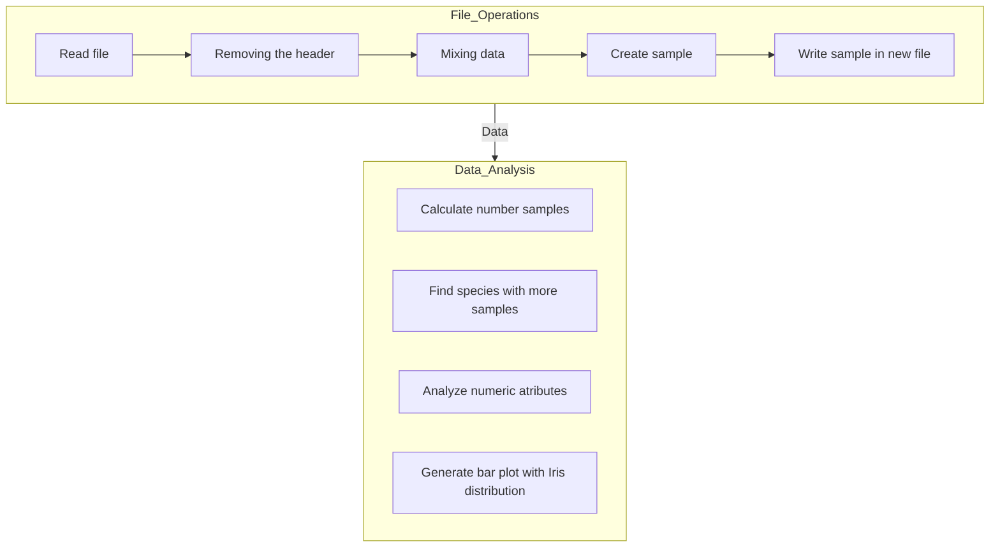
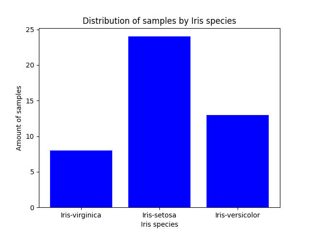

# Iris Project

This project analyzes a dataset of Iris plant characteristics, focusing on three species: *Iris versicolor*, *Irisi setosa*, and *Iris virginica*. The data set contains information about petal and sepal dimensions. The project is divided into two phases, outlined below.

In this project, the aim was to construct a program that do analysis using a dataset of Iris plant. The dataset present information of three species of Iris (I. versicolor, I. sectosa, I. virginica) about the length and width of two floral structures of the plant (petal and sepal). The solution was splited in two phases.

## Objectives

- Read the Iris dataset from a csv file.
- Create a 30% random sample of the original dataset and save it in a txt file.
- Calculate the distribution of samples for each Iris species.
- identify the species with highest number of samples.
- Generate a bar plot illustrating the distribution of Iris species within the sample.
- For each of the four numeric atribute (petal length and width, sepal length and width) calculate:
    - minimum value
    - maximum value
    - mean
    - standart deviation

## Project Structure

The project is implemented in a single Python file (`main.py`) and utilizes several functions to achieve its objectives:



### Function Descriptions:

- `readFile(name)`: Reads the specified file `(name)` and returns a list containing each line of the file as a string.
- `makeListWithoutHeader(list)`: Removes the header row from the input list and returns a new list containing only data rows.
- `mixing(list, amount)`: Randomly shuffles the elements of the input list a specified number of times `(amount)`.
- `sampling(list, index)`: Creates a sample of the input list with a size determined by the index (proportion of the original list). The function first shuffles the list using `mixing` to ensure randomness.
- `recordSample(header, sample, name)`: Writes the provided header and sample data to a new file specified by `name`.
- `countSamples(sample, species)`: Calculates the number of samples for each Iris species in the provided sample data.
- `makePlot(spp, amount)`: Generates a bar plot visualizing the distribution of Iris species. It takes the list of species `(spp)` and their corresponding sample counts `(amount)` as input.
- `mean(list)`: Calculates the mean of a numeric list.
- `sd(list)`: Calculates the standard deviation of a numeric list.
- `analyzeNumericAttributes(header, data)`: Analyzes the numeric attributes from the input data. It extracts the attribute names from the header and calculates the minimum, maximum, mean, and standard deviation for each attribute.

## Setup Instructions

1. Clone Repository:
```bash
git clone <repository-url>
cd <repository-directory>
```

2. Setup Virtual Environment:
```bash
python -m venv .venv
source .venv/Scripts/activate
```

3. Install Dependencies:
```bash
pip install -r requirements.txt
```
or
```bash
poetry install
```

4. Prepare Data File:
Ensure you have the required CSV file with Iris data.

5. Run Script:
```bash
python main.py
```

## Main Results

#### Distribution of samples by species (with percentages):

```python
Iris-virginica  - samples:  10 (22.22%)
Iris-setosa  - samples:  25 (55.56%)
Iris-versicolor  - samples:  10 (22.22%)
Total of samples: 45
```

#### Species with most samples:

```python
Species with more samples: Iris-virginica
```

#### Bar plot with species distribution:



#### Resume of numeric attributes:

```python
SepalLengthCm 	 - Minimum: 4.3, Maximum: 7.9, Mean: 5.84, SD: 0.83
SepalWidthCm 	 - Minimum: 2.0, Maximum: 4.4, Mean: 3.06, SD: 0.44
PetalLengthCm 	 - Minimum: 1.0, Maximum: 6.9, Mean: 3.76, SD: 1.77
PetalWidthCm 	 - Minimum: 0.1, Maximum: 2.5, Mean: 1.20, SD: 0.76
```
